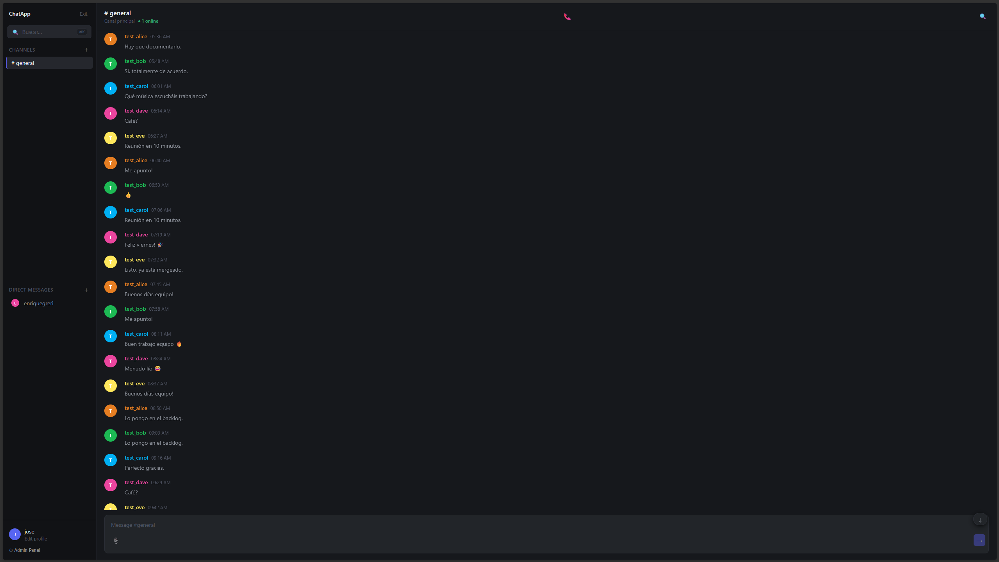
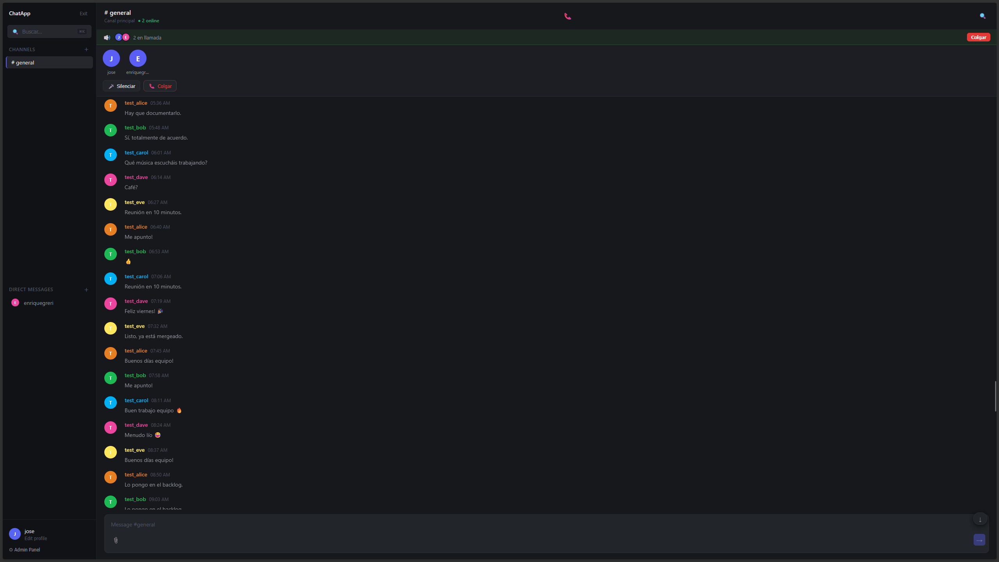

<div align="center">

# ChatApp

**Self-hosted team chat with voice calls.**
No message caps. No paywalls. No MongoDB. Runs on a $6/month VPS.

[](https://github.com/enriquegri/chat-app/actions/workflows/build-apk.yml)
[](https://github.com/enriquegri/chat-app/actions/workflows/deploy-pages.yml)
[](LICENSE)
[](https://go.dev)
[](https://react.dev)



</div>

---

## Why ChatApp?

Self-hosted chat tools tend to fall into two traps: too heavy to run on affordable hardware, or too limited to use in production. ChatApp is neither.

- **2 containers** — backend + database. Nothing else required.
- **~512 MB RAM** — runs comfortably on the cheapest VPS plans.
- **MariaDB** — the most widely deployed database in self-hosted setups. No NoSQL, no replica sets, no migration surprises.
- **No artificial limits** — unlimited message history, unlimited push notifications, voice calls included. Everything works from day one, no license tiers.
- **One APK download** — install directly on Android without an app store.

---

## Features

- **Real-time messaging** via WebSockets
- **Voice calls** — up to 50 simultaneous participants (LiveKit SFU)
- **Direct messages** between users
- **Thread replies** on any message
- **Two-factor authentication** (TOTP)
- **Web Push notifications** — powered by your own server, no third-party caps
- Multiple channels, public and private
- File and image uploads
- Emoji reactions
- Message editing and deletion
- Link previews
- Global and per-channel search
- Online presence per channel
- Admin dashboard (user and channel management)
- **Android APK** — one download, no app store required

### Voice calls



Each participant uploads one audio stream to your LiveKit server, which forwards it to everyone else — no mesh overhead, no per-user upload scaling. The audio never leaves your infrastructure.

---

## Quick start

```bash
git clone https://github.com/enriquegri/chat-app.git
cd chat-app
cp .env.example .env   # edit with your values
# add ssl/origin.pem and ssl/origin.key
docker compose up -d --build
```

Create your first admin:

```bash
docker compose exec backend chatadmin create-user \
  --username admin --email admin@example.com \
  --password YourPassword --role admin
```

That's it. Backend + database + proxy running in 3 containers.

---

## Tech stack

| Layer | Technology |
|---|---|
| Backend | Go 1.22 + gorilla/websocket |
| Frontend | React 19 + Vite |
| Database | MariaDB |
| Voice | LiveKit SFU (self-hosted Docker) |
| Mobile | Capacitor (Android APK) |
| Proxy | Nginx |
| CI/CD | GitHub Actions |

---

## Privacy

Your data stays on your server. Specifically:

- No telemetry or callbacks to vendor servers
- No third-party CDN — all assets served from your domain
- Push notifications use your own VAPID keys (no Firebase, no Mattermost gateway)
- Voice audio goes through your own LiveKit instance, never a third-party server
- Link previews are fetched server-side (external sites see your server IP, not your users')

The only external dependency is the browser vendor's push infrastructure (Google FCM / Mozilla), which is the W3C standard for Web Push and is opt-in.

---

## Requirements

- VPS with Docker + Docker Compose (1 GB RAM is enough)
- A domain with an A record pointing to your VPS
- TLS certificate (Cloudflare Origin Certificate recommended)
- UDP ports 50000–50200 open on the firewall (LiveKit voice media)

---

## Self-hosting guide

### 1. TLS certificate (Cloudflare — recommended)

1. Cloudflare → SSL/TLS → Origin Server → Create Certificate
2. Save to `ssl/origin.pem` and `ssl/origin.key`
3. Set SSL/TLS mode to **Full (strict)**

### 2. Environment

```bash
cp .env.example .env
```

Key variables:

| Variable | Description |
|---|---|
| `DB_PASSWORD` | MariaDB password |
| `JWT_SECRET` | Long random string |
| `ENCRYPTION_KEY` | `openssl rand -hex 32` |
| `PUBLIC_URL` | `https://api.your-domain.com` |
| `LIVEKIT_URL` | `wss://api.your-domain.com/livekit` |
| `LIVEKIT_API_KEY` | From your `livekit.yaml` |
| `LIVEKIT_API_SECRET` | From your `livekit.yaml` |
| `VAPID_PUBLIC_KEY` | `npx web-push generate-vapid-keys` |
| `VAPID_PRIVATE_KEY` | Same command as above |

### 3. LiveKit config

Create `livekit.yaml` (gitignored — contains secrets):

```yaml
port: 7880
rtc:
  tcp_port: 7881
  port_range_start: 50000
  port_range_end: 50200
  node_ip: YOUR_VPS_PUBLIC_IP
keys:
  YOUR_API_KEY: YOUR_API_SECRET
logging:
  level: info
```

### 4. Nginx

Edit `nginx.conf` — replace `api.enriquegr.dev` with your API domain.

### 5. Launch

```bash
docker compose up -d --build
```

### 6. Frontend

Deploy the React app to GitHub Pages (or any static host):

1. Fork this repo
2. Set `VITE_API_URL` and `VITE_API_HOST` in `.github/workflows/deploy-pages.yml`
3. Enable GitHub Pages (Settings → Pages → `gh-pages` branch)
4. Add a `CNAME` file in `frontend/public/` with your frontend domain

Every push to `main` builds and deploys automatically.

### 7. Android APK

Every push to `main` builds a debug APK and publishes it to [GitHub Releases](../../releases). Download it and install directly — no app store required.

---

## Admin tools

**Web panel** — log in as admin → click Admin in the sidebar.

**CLI** — runs inside the container:

```bash
# Create user
docker compose exec backend chatadmin create-user \
  --username alice --email alice@example.com --password Pass123 --role user

# Reset password
docker compose exec backend chatadmin reset-password \
  --email alice@example.com --password NewPass456

# Clear chat history
docker compose exec backend chatadmin clear-chats --channel general
docker compose exec backend chatadmin clear-chats --all
```

---

## API reference

### Public

```
GET  /health
GET  /registration-status
POST /auth/register    { username, email, password }
POST /auth/login       { email, password }
POST /auth/2fa/verify  { temp_token, code }
```

### Protected (`Authorization: Bearer <token>`)

```
GET  /api/channels
GET  /api/channels/:id/messages
GET  /api/channels/:id/search?q=
POST /api/channels/:id/voice/token   → { token, url }
GET  /api/dm
POST /api/dm/:userId
GET  /api/users
GET  /api/search?q=
POST /api/upload
POST /api/messages/:id/reactions/:emoji
GET  /api/messages/:id/thread
PUT  /api/messages/:id
DELETE /api/messages/:id
GET  /api/2fa/setup
POST /api/2fa/enable
POST /api/push/subscribe
```

### WebSocket — `WS /ws/:channelId?token=<JWT>`

```json
// Send
{ "type": "message", "content": "Hello!" }
{ "type": "message", "reply_to_id": 42, "content": "Got it" }
{ "type": "typing" }
{ "type": "call_join", "avatar_color": "#5b5ef4" }
{ "type": "call_leave" }

// Receive
{ "type": "message",      "message": { ... } }
{ "type": "online_update","users": ["alice", "bob"], "count": 2 }
{ "type": "typing",       "username": "alice" }
{ "type": "call_state",   "call_participants": [ { "user_id", "username", "avatar_color" } ] }
```

---

## Project structure

```
chat-app/
├── backend/
│   ├── main.go
│   ├── config/          # Env var loading
│   ├── models/          # User, Channel, Message, VoiceParticipant
│   ├── handlers/        # HTTP + WebSocket + voice + push + 2FA
│   ├── services/        # Auth, Channel, Push, Hub (broadcast + call state)
│   ├── middleware/      # JWT auth, admin check, rate limiting
│   ├── db/migrations/   # SQL schema
│   ├── cmd/chatadmin/   # Admin CLI
│   └── Dockerfile
├── frontend/
│   ├── src/
│   │   ├── pages/       # Login, Chat, Admin, Profile
│   │   ├── components/  # Message, Thread, VoiceCall, VoiceCallBar, GlobalSearch…
│   │   ├── hooks/       # useAuth, useWebSocket, useVoiceCall, usePushNotifications
│   │   └── services/    # API client
│   ├── capacitor.config.json
│   └── package.json
├── .github/
│   ├── assets/          # README screenshots
│   └── workflows/
│       ├── deploy-pages.yml
│       └── build-apk.yml
├── livekit.yaml         # gitignored — contains API secret
├── nginx.conf
├── docker-compose.yml
└── .env.example
```

---

## Contributing

Issues and pull requests are welcome.

1. Fork the repo
2. Create a branch: `git checkout -b feature/something`
3. Commit and open a PR

Please open an issue first for significant changes.

---

## License

MIT
